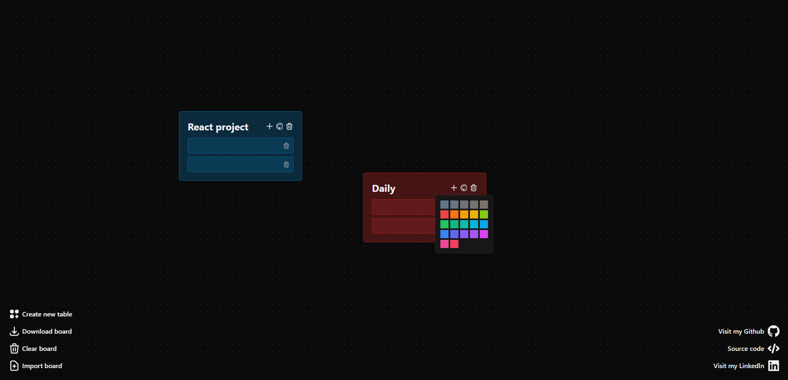

# Simple kanban / notes application.


## This project was built using:
- React.js + Vite
- Typescript
- Framer Motion
- Tailwind css

## Features: 
- Creating tables/lists
- Changing their colors
- Adding tasks to them
- Downloading and importing boards from .json
- Everything is saved in local storage

## How to use?
Go to your terminal and run:
- ```git clone https://github.com/najskowski/kanban.git```  
- ```cd kanban```  
- ```npm install```  
- ```npm run dev```  

After running all of the above commands, navigate to [http://localhost:5173/](http://localhost:5173/).
